# MineVision Dashboard — Documentación de Arquitectura

> Fecha: 2026-02-22 · Stack: Python · Dash · Plotly · Dash Bootstrap Components

---

## Tabla de Contenidos

1. [Estructura del Proyecto](#1-estructura-del-proyecto)
2. [Arquitectura General](#2-arquitectura-general)
3. [Flujo de Inicialización](#3-flujo-de-inicialización)
4. [Capa de Datos (`data/`)](#4-capa-de-datos-data)
5. [Componentes (`components/`)](#5-componentes-components)
6. [Sistema de Routing](#6-sistema-de-routing)
7. [Callbacks de Dash](#7-callbacks-de-dash)
8. [Páginas — Layouts](#8-páginas--layouts)
   - [8.1 Overview (Resumen)](#81-overview-resumen)
   - [8.2 Producción](#82-producción)
   - [8.3 Equipos](#83-equipos)
   - [8.4 Seguridad](#84-seguridad)
   - [8.5 Costos](#85-costos)
9. [Flujo completo de una petición de página](#9-flujo-completo-de-una-petición-de-página)
10. [Mapa de dependencias entre módulos](#10-mapa-de-dependencias-entre-módulos)

---

## 1. Estructura del Proyecto

```
mining-dashboard/
├── app.py                  # Entry-point · instancia Dash · routing · navbar toggle
├── requirements.txt
├── assets/                 # CSS global, íconos SVG (servidos estáticamente por Dash)
├── components/
│   ├── __init__.py
│   └── navbar.py           # Función create_navbar() → dbc.Navbar
├── data/
│   ├── __init__.py
│   └── mining_data.py      # Generadores de DataFrames sintéticos + KPIs
└── pages/
    ├── __init__.py
    ├── overview.py         # Página "Resumen"
    ├── produccion.py       # Página "Producción"
    ├── equipos.py          # Página "Equipos"
    ├── seguridad.py        # Página "Seguridad"
    └── costos.py           # Página "Costos"
```

---

## 2. Arquitectura General

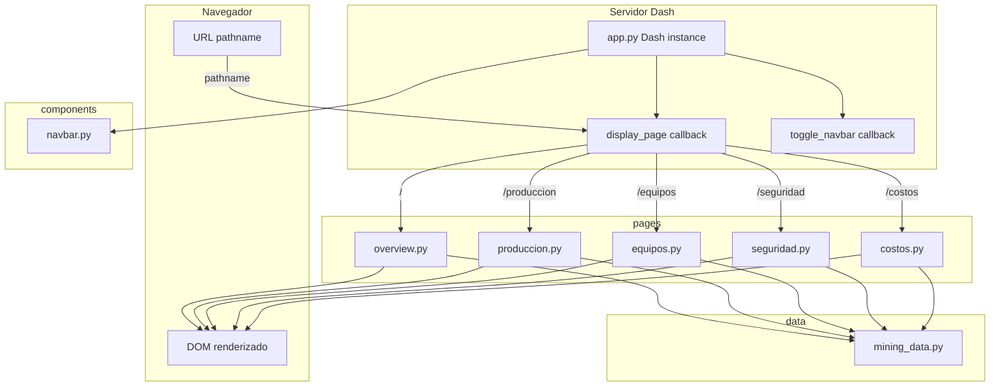

---

## 3. Flujo de Inicialización

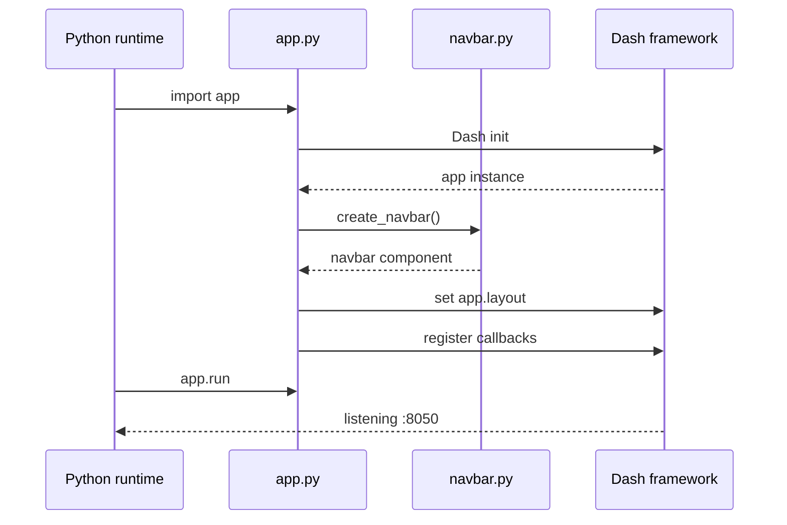

---

## 4. Capa de Datos (`data/`)

Todos los datos son **sintéticos** generados en memoria con `numpy` y `pandas`. No hay base de datos ni archivos externos.

### Funciones expuestas

| Función | Retorno | Descripción |
|---|---|---|
| `get_production_df()` | `DataFrame` 365 filas | Tonelaje, leyes Cu/Au, recuperación, finos diarios |
| `get_equipment_df()` | `DataFrame` ~4745 filas | Disponibilidad/utilización/mantenimiento por equipo×día |
| `get_safety_df()` | `DataFrame` 365 filas | Incidentes, casi-accidentes, horas-hombre, días sin accidente |
| `get_costs_df()` | `DataFrame` 72 filas | Costos mensuales por 6 categorías (12 meses × 6) |
| `get_kpis()` | `dict` | Resumen numérico (llama internamente a prod y safety) |

### Modelo de datos

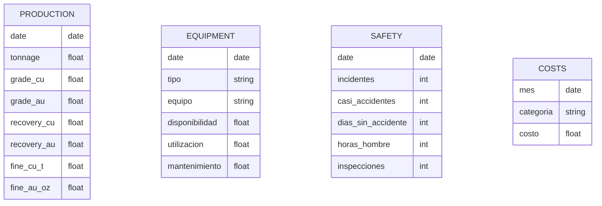

### Flujo de generación de datos

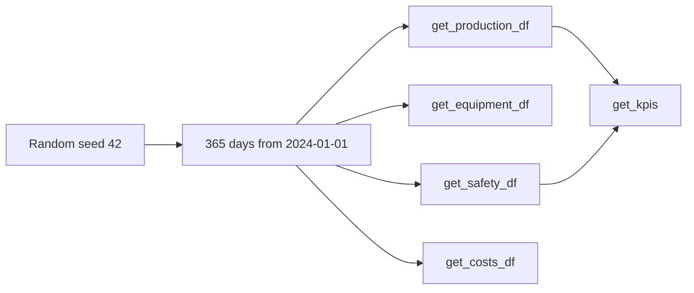

---

## 5. Componentes (`components/`)

### `navbar.py` — `create_navbar()`

Retorna un `dbc.Navbar` sticky con:
- Logo SVG + brand text
- `dbc.NavbarToggler` (id `navbar-toggler`) para mobile
- `dbc.Collapse` (id `navbar-collapse`) con 5 `NavLink`s

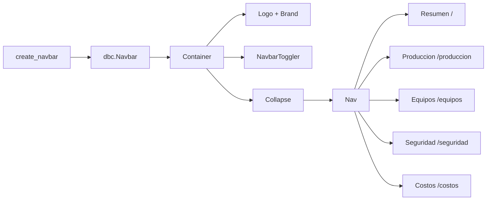

---

## 6. Sistema de Routing

Dash utiliza `dcc.Location` para leer el pathname del navegador. El callback `display_page` actúa como router SPA.

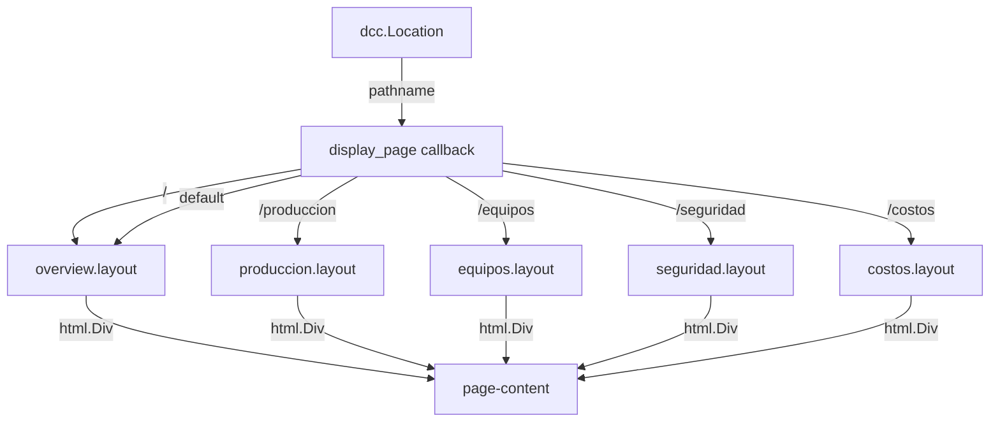

> Cada `layout()` se llama **en cada navegación** — los datos se regeneran sincrónicamente.

---

## 7. Callbacks de Dash

La app tiene exactamente **2 callbacks registrados** en `app.py`:

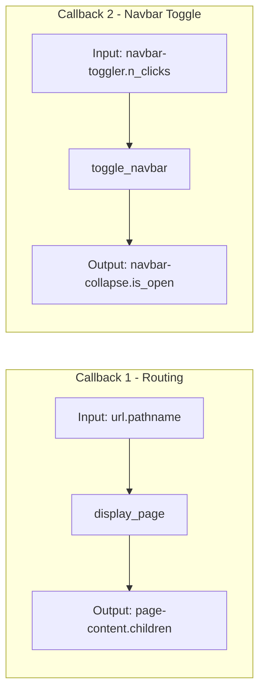

No hay callbacks reactivos dentro de las páginas — todos los gráficos son **estáticos** (figuras Plotly pre-construidas en `layout()`).

---

## 8. Páginas — Layouts

Cada página sigue el mismo patrón:

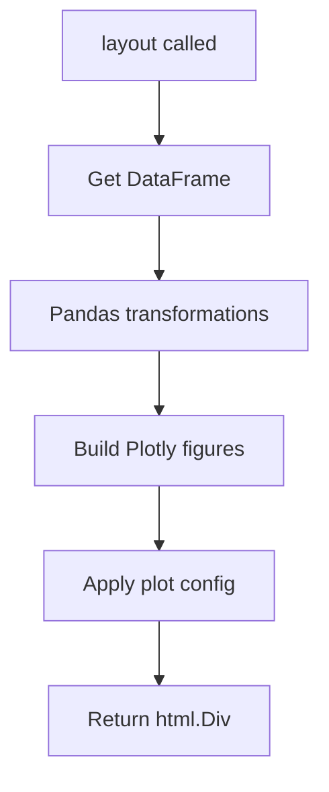

---

### 8.1 Overview (Resumen) — `pages/overview.py`

**Datos:** `get_production_df()`, `get_safety_df()`, `get_kpis()`

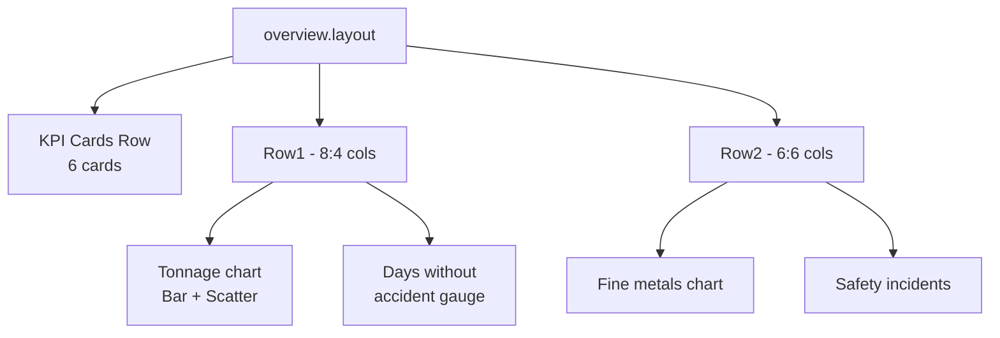

**Transformaciones clave:**
- Resample diario → mensual con `groupby("month").agg(...)`
- Rolling mean 3 meses para promedio móvil

---

### 8.2 Producción — `pages/produccion.py`

**Datos:** `get_production_df()`

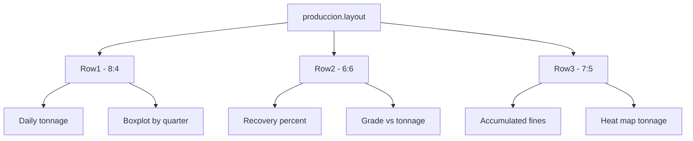

---

### 8.3 Equipos — `pages/equipos.py`

**Datos:** `get_equipment_df()` (4745 filas: 13 equipos × 365 días)

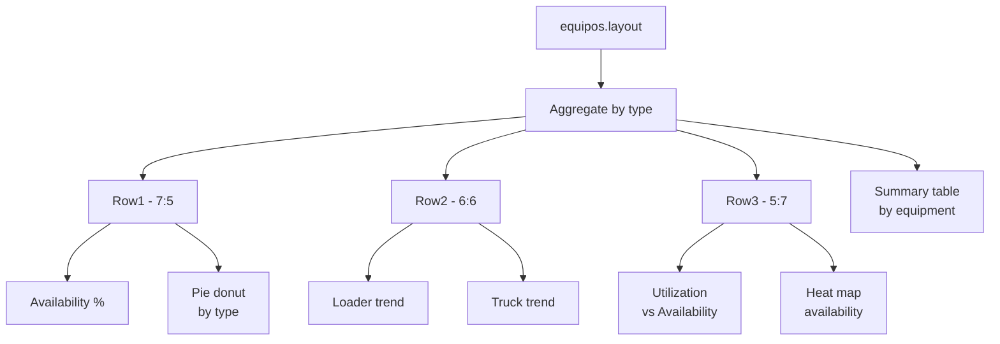

---

### 8.4 Seguridad — `pages/seguridad.py`

**Datos:** `get_safety_df()`

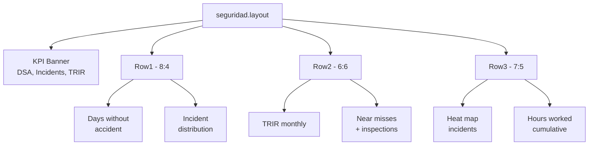

---

### 8.5 Costos — `pages/costos.py`

**Datos:** `get_costs_df()` + `get_production_df()` (para costo/tonelada)

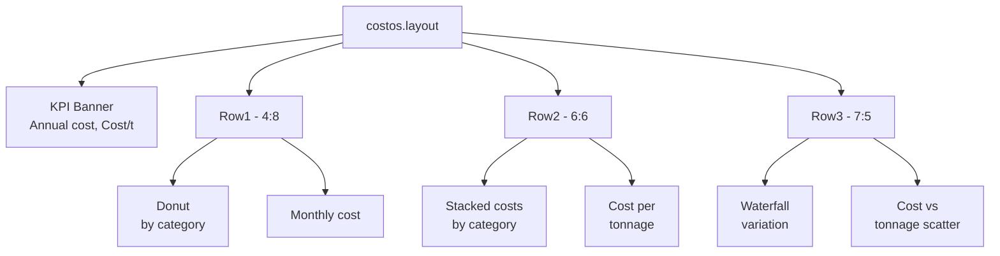

---

## 9. Flujo completo de una petición de página

Ejemplo: usuario hace clic en "Producción" en la navbar.

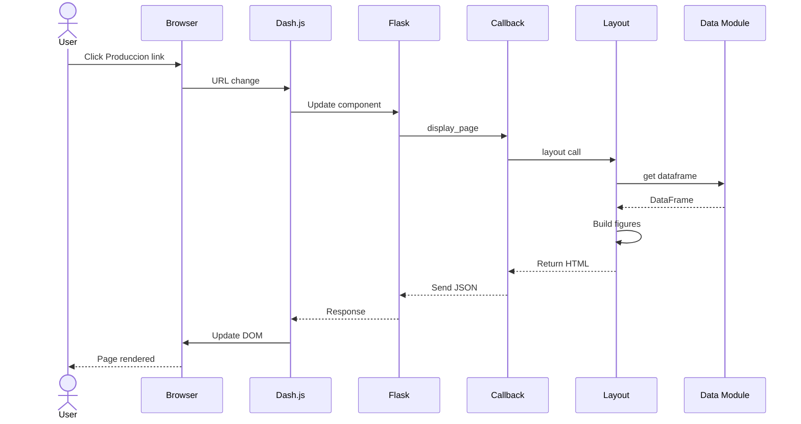

---

## 10. Mapa de dependencias entre módulos

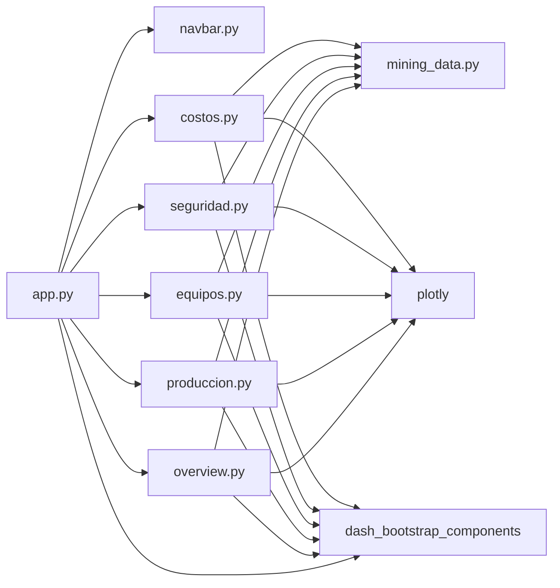

---

### Notas de diseño

| Decisión | Razón |
|---|---|
| `suppress_callback_exceptions=True` | El `page-content` se puebla dinámicamente; Dash no puede validar IDs en arranque |
| `server = app.server` | Expone el objeto Flask para despliegue con gunicorn |
| Datos sintéticos en memoria | No requiere BD; reproducibles con `seed(42)` |
| Layouts sin callbacks reactivos | Todos los gráficos se pre-computan al navegar; no hay interactividad intra-página |
| `dcc.Location(refresh=False)` | SPA — navegación sin reload completo de página |
