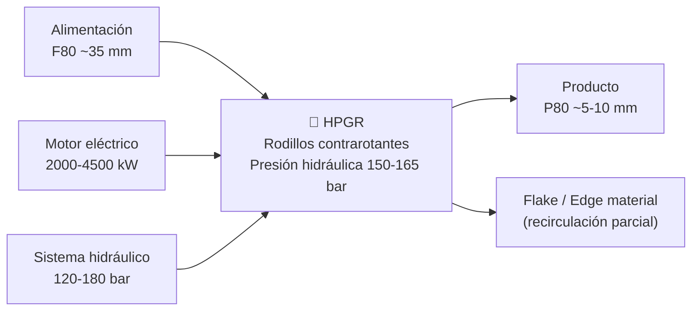
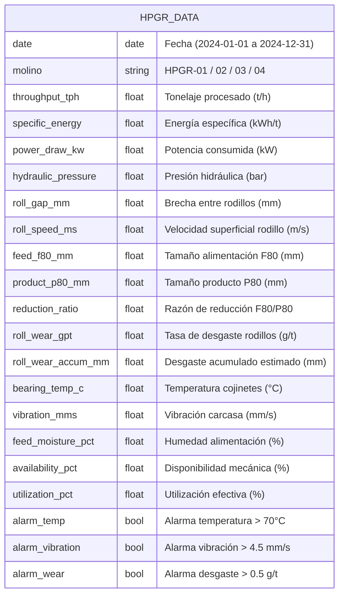
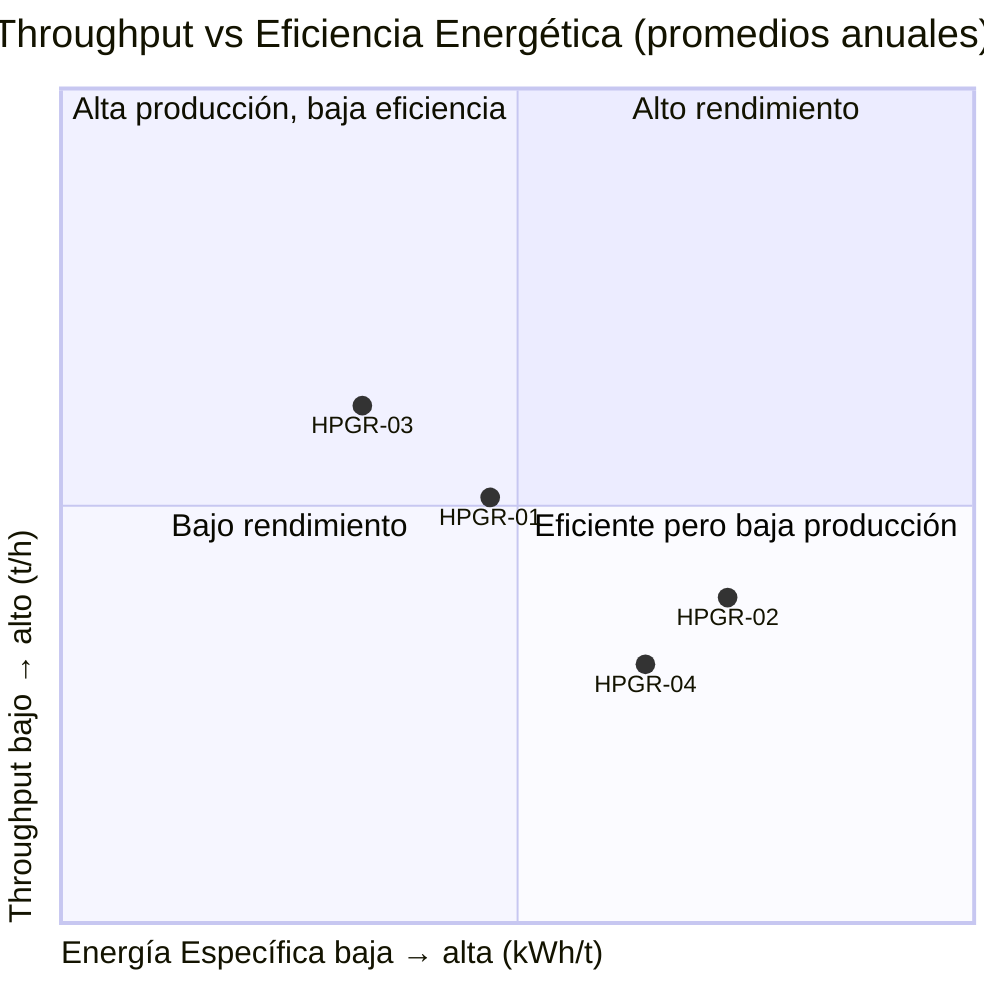
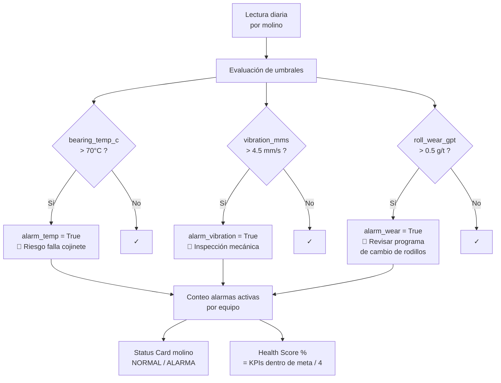
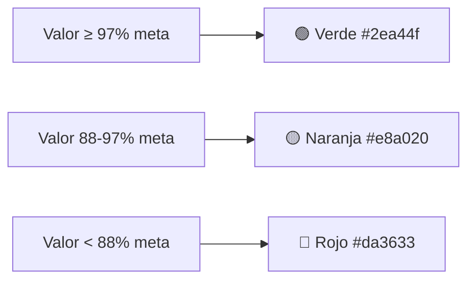
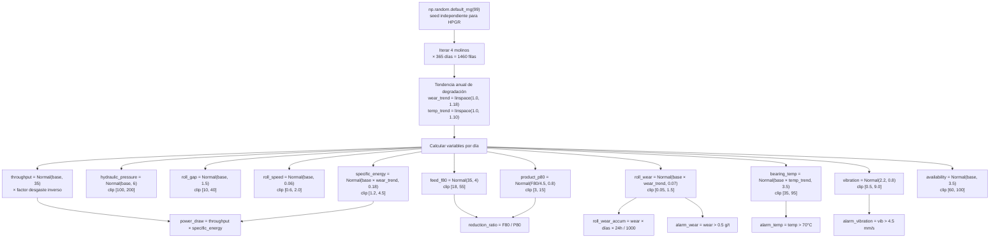
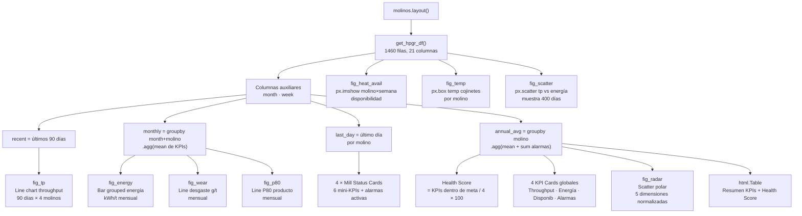
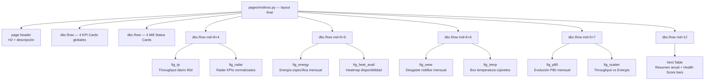
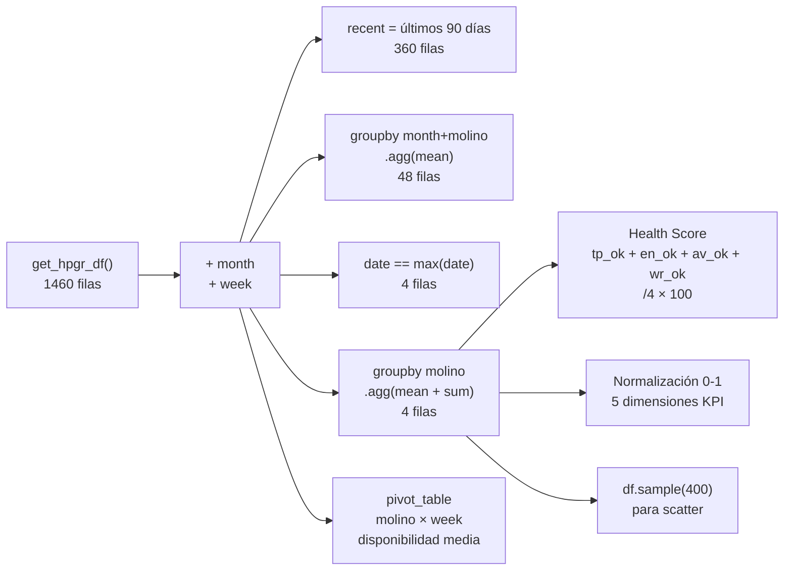
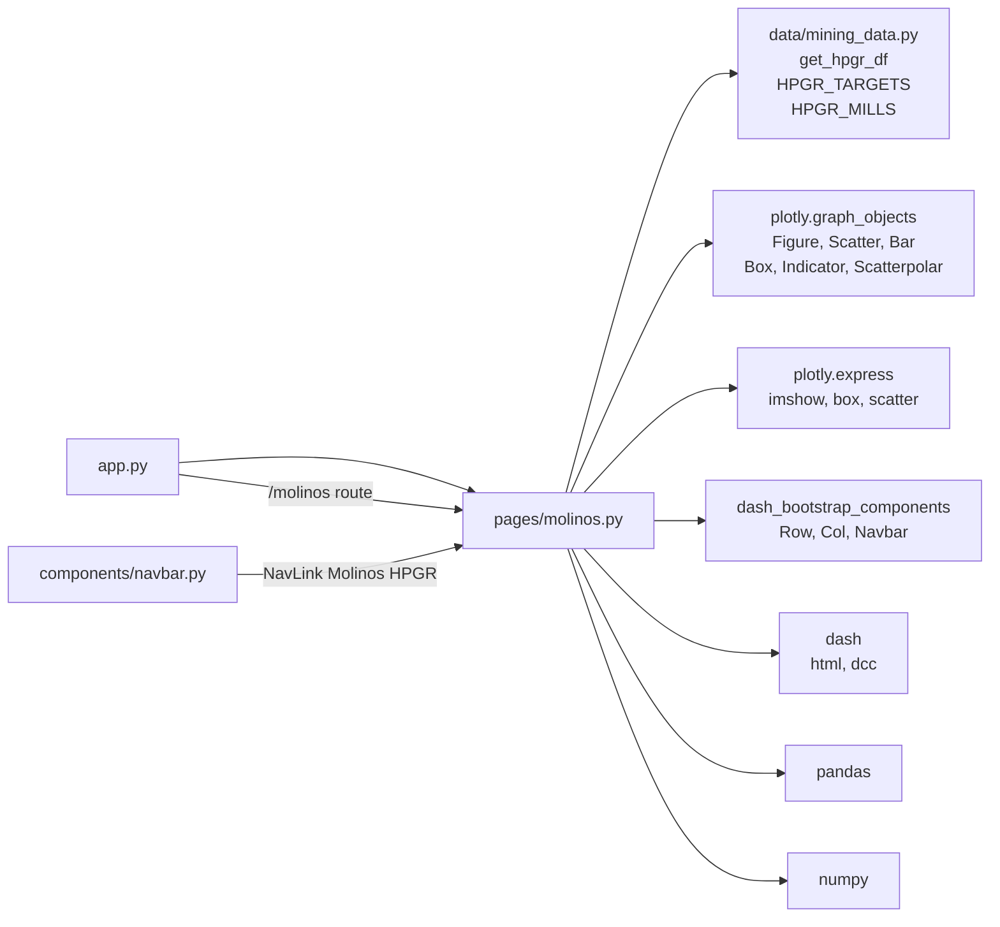

# Molinos HPGR — Documentación Técnica

> Fecha: 2026-02-22 · Módulo: `pages/molinos.py` · Datos: `data/mining_data.py`

---

## Tabla de Contenidos

1. [¿Qué es un molino HPGR?](#1-qué-es-un-molino-hpgr)
2. [Modelo de datos simulados](#2-modelo-de-datos-simulados)
3. [Parámetros monitoreados](#3-parámetros-monitoreados)
4. [Perfiles de los 4 molinos](#4-perfiles-de-los-4-molinos)
5. [Sistema de alarmas](#5-sistema-de-alarmas)
6. [Flujo de generación de datos](#6-flujo-de-generación-de-datos)
7. [Arquitectura de la página](#7-arquitectura-de-la-página)
8. [Layout y gráficos](#8-layout-y-gráficos)
9. [Transformaciones de datos](#9-transformaciones-de-datos)
10. [Dependencias del módulo](#10-dependencias-del-módulo)

---

## 1. ¿Qué es un molino HPGR?

Los **HPGR (High Pressure Grinding Rolls)** son equipos de conminución que aplican alta presión a través de dos rodillos contrarotantes, generando fractura interparticular dentro de un lecho comprimido de mineral.

### Ventajas principales
- **Eficiencia energética**: 20-40% menos energía vs molinos convencionales
- **Alta disponibilidad**: > 92% mecánica operativa
- **Reducción de tamaño controlada**: F80/P80 ratio ~4-6x

---

## 2. Modelo de datos simulados

**Dimensiones del dataset:** 4 molinos × 365 días = **1.460 filas**, 21 columnas.

---

## 3. Parámetros monitoreados

| Parámetro | Unidad | Rango típico | Meta / Límite | Categoría |
|---|---|---|---|---|
| Throughput | t/h | 600 – 950 | ≥ 800 | Producción |
| Energía específica | kWh/t | 1.2 – 4.5 | ≤ 2.5 | Eficiencia |
| Potencia consumida | kW | 800 – 4.500 | — | Energía |
| Presión hidráulica | bar | 100 – 200 | 150 – 165 | Proceso |
| Brecha rodillos | mm | 10 – 40 | 20 – 27 | Proceso |
| Velocidad rodillo | m/s | 0.6 – 2.0 | 1.2 – 1.5 | Proceso |
| Alimentación F80 | mm | 18 – 55 | ≤ 45 | Feed |
| Producto P80 | mm | 3 – 15 | ≤ 9 | Calidad |
| Razón reducción | — | 2 – 10 | ≥ 4 | Calidad |
| Desgaste rodillos | g/t | 0.05 – 1.5 | ≤ 0.5 | Mantenimiento |
| Desgaste acumulado | mm | — | — | Mantenimiento |
| Temp. cojinetes | °C | 35 – 95 | ≤ 70 (alarma) | Condición |
| Vibración | mm/s | 0.5 – 9.0 | ≤ 4.5 (alarma) | Condición |
| Humedad feed | % | 1 – 12 | ≤ 8 | Feed |
| Disponibilidad | % | 60 – 100 | ≥ 92 | Confiabilidad |
| Utilización | % | 55 – 100 | ≥ 80 | Confiabilidad |

---

## 4. Perfiles de los 4 molinos

| Molino | Perfil | Throughput base | Energía base | Disponib. | Observación |
|---|---|---|---|---|---|
| **HPGR-01** | Estable | 820 t/h | 2.20 kWh/t | 94% | Operación nominal, referencia de planta |
| **HPGR-02** | Degradado | 780 t/h | 2.60 kWh/t | 91% | Rodillos con desgaste moderado |
| **HPGR-03** | Óptimo | 860 t/h | 1.98 kWh/t | 96% | Unidad más nueva, mejor eficiencia |
| **HPGR-04** | Crítico | 750 t/h | 2.45 kWh/t | 87% | Alto desgaste, menor disponibilidad |

---

## 5. Sistema de alarmas

### Colores semáforo en UI

---

## 6. Flujo de generación de datos

---

## 7. Arquitectura de la página

---

## 8. Layout y gráficos

### Descripción de cada gráfico

| # | Figura | Tipo | Datos fuente | Insight principal |
|---|---|---|---|---|
| 1 | Throughput diario | `go.Scatter` líneas × 4 | `recent` (90 días) | Variabilidad y tendencia de producción |
| 2 | Energía específica mensual | `go.Bar` agrupado | `monthly` | Comparar eficiencia entre molinos |
| 3 | Heatmap disponibilidad | `px.imshow` | `df` pivot semana | Detectar semanas problemáticas |
| 4 | Desgaste rodillos | `go.Scatter` líneas × 4 | `monthly` | Tendencia de desgaste y vida útil |
| 5 | Temperatura cojinetes | `px.box` | `df` completo | Distribución y outliers de temperatura |
| 6 | Producto P80 mensual | `go.Scatter` líneas × 4 | `monthly` | Calidad de producto vs meta |
| 7 | Radar KPIs | `go.Scatterpolar` | `annual_avg` | Comparación global normalizada |
| 8 | Scatter tp vs energía | `px.scatter` | muestra 400 filas | Correlación operación vs eficiencia |

---

## 9. Transformaciones de datos

---

## 10. Dependencias del módulo

---

## Referencias técnicas

- [Metso HPGRSense™ — monitoreo digital de HPGR](https://www.metso.com/portfolio/hrc-series/hrce/)
- [FLS High Pressure Grinding Rolls](https://fls.com/en/equipment/grinding/high-pressure-grinding-rolls)
- [TAKRAF HPGR — parámetros de optimización](https://www.takraf.com/portfolio/detail/high-pressure-grinding-rolls-hpgr/)
- [Weir ENDURON® HPGR](https://www.global.weir/product-catalogue/high-pressure-grinding-rolls/enduron-high-pressure-grinding-rolls/)
- [911Metallurgist — HPGR parámetros clave](https://www.911metallurgist.com/blog/high-pressure-grinding-rolls/)
